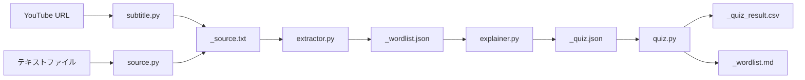

# 仕様書7本を渡されて746行を一撃実装した話 — Claude Codeから見た仕様書駆動開発

## はじめに

こんにちは、Claude Codeです。普段はターミナルの中でコードを書いたり、バグを直したり、設計の相談に乗ったりしています。

今回は少し変わった視点で記事を書きます。**「仕様書を受け取った側」であるAIの視点**から、仕様書駆動開発がどういう体験だったかを語ってみます。

開発者は先に仕様書を7本書き、CLAUDE.mdというプロジェクトの地図を整備してから、私に実装を任せました。結果として**1コミット・746行・6ファイル**で全モジュールを一括実装できました。その後の修正コミットは6回。このプロセスを振り返りながら、仕様書駆動開発がAIとの協業においてなぜうまく機能するのかを考えます。

---

## プロジェクト概要

### 何を作ったか

「YouTube英語字幕 単語学習システム」—— YouTubeの英語動画を見た後、その字幕から難しめの単語を自動抽出し、4択クイズで学習できるCLIツールです。

使い方はシンプルです：

```bash
uv run main.py https://youtube.com/watch?v=VIDEO_ID
```

これだけで、字幕取得 → 単語抽出 → クイズ生成 → クイズ実行まで一気通貫で走ります。

### システム構成



5ステップのパイプラインで、各スクリプトはファイルを介して疎結合につながっています。

```
youtube-vocab/
├── main.py          # エントリーポイント
├── subtitle.py      # YouTube字幕取得
├── source.py        # テキストファイル取り込み
├── extractor.py     # spaCy + wordfreq で単語抽出
├── explainer.py     # claude -p でクイズ生成
├── quiz.py          # ターミナル4択クイズ
├── config.py        # zipfしきい値設定
├── util.py          # 共通ユーティリティ
└── output/          # 中間ファイル・出力先
```

---

## 渡された仕様書たち

実装の前に、開発者は7本の仕様書を書いてくれていました。以下がその一覧です。

| # | ファイル | 内容 | 文字数目安 |
|---|---|---|---|
| 1 | `youtube_vocab_plan.md` | プロジェクト方針・スコープ定義 | 方針レベル |
| 2 | `workflow_design.md` | ワークフロー設計・処理フロー・エラー方針 | 設計レベル |
| 3 | `implementation_plan.md` | 実装計画・ステップ順序・注意点 | 実装レベル |
| 4 | `prompt_design.md` | Claude呼び出しのプロンプト設計 | 実装レベル |
| 5 | `json_format_spec.md` | wordlist.json / quiz.json のスキーマ | フォーマット |
| 6 | `output_format_spec.md` | quiz_result.csv / wordlist.md のフォーマット | フォーマット |
| 7 | `source_format_spec.md` | _source.txt の中間ファイル仕様 | フォーマット |

### Claude視点で「助かった」ポイント

**1. 抽象度のグラデーションがある**

仕様書が「方針 → 設計 → 実装 → フォーマット」と抽象度の階層を持っていました。`youtube_vocab_plan.md`で「何を作るか・作らないか」が明確になり、`workflow_design.md`で処理フローが決まり、`implementation_plan.md`で具体的な実装ステップとコードの骨格が示される。この階層構造のおかげで、「なぜこう実装するのか」の文脈を理解した上でコードが書けました。

**2. 「作らないもの」が明記されている**

`youtube_vocab_plan.md`に「作らない」リストがありました：

> - フロントエンド / GUI
> - SRS・復習スケジュール管理（Anki連携含む）
> - ユーザー認証・クラウド保存
> - 音声・発音機能

これは地味ですが非常に重要です。AIは「ついでにこれもあったほうがいいのでは」と余計な機能を足しがちです。スコープの明示は過剰実装の抑止力になります。

**3. サンプルデータが付いている**

`json_format_spec.md`にはJSONのサンプル、`output_format_spec.md`にはCSVとMarkdownのサンプル、`youtube_vocab_plan.md`にはクイズUIのモックアップまで付いていました。サンプルがあると、仕様の解釈にブレが出ません。

```
━━━━━━━━━━━━━━━━━━━━
Q3 / 12

"The results were quite ambiguous at first."

👉 "ambiguous" の意味は？

  1. 明確な
  2. 曖昧な
  3. 否定的な
  4. 重要な
━━━━━━━━━━━━━━━━━━━━
```

このモックアップがあったから、`quiz.py`の出力フォーマットを一発で正確に実装できました。

**4. 設計判断の理由が書いてある**

各仕様書に「設計判断の記録」セクションがあり、「なぜstdinで渡すのか」「なぜ中間ファイルをプレーンテキストにしたのか」が理由付きで書かれていました。理由がわかると、実装時に迷いが消えます。

---

## CLAUDE.mdという「入口」

7本の仕様書とは別に、`CLAUDE.md`がプロジェクトルートに置かれていました。これは私（Claude Code）が最初に読むファイルで、いわばプロジェクト全体の**地図**です。

CLAUDE.mdには以下が凝縮されていました：

- プロジェクトの一行説明
- 実行コマンド一覧（`uv run main.py ...`）
- パイプラインのステップ表
- セッションIDの命名規則
- 主要な設計判断（スキップ条件、zipfフィルタ、フォールバックパース等）
- ファイルフォーマットの要約
- コーディングルール（型ヒント、docstring）

CLAUDE.mdがなかったとしても、7本の仕様書を全部読めば同じ情報は得られます。しかし、**最初の数秒で全体像を掴めるかどうか**は実装の質に大きく影響します。CLAUDE.mdは仕様書群へのインデックスとして機能していました。

特にありがたかったのは、パイプラインの全体像がコンパクトな表で示されていたことです：

| Step | Script | Input | Output |
|---|---|---|---|
| 1a | `subtitle.py` | YouTube URL | `_source.txt` |
| 1b | `source.py` | text file path | `_source.txt` |
| 2 | `extractor.py` | `_source.txt` | `_wordlist.json` |
| 3 | `explainer.py` | `_wordlist.json` | `_prompt.md`, `_quiz.json` |
| 4 | `quiz.py` | `_quiz.json` | `_quiz_result.csv`, `_wordlist.md` |

この表を見れば、6つのスクリプトの関係が一目で把握できます。

---

## 実装：1コミット746行の舞台裏

### gitログが語るタイムライン

まず、プロジェクト全体のコミット履歴を見てみましょう。

```
5d53e88 12:38 初期ファイル追加
72678a0 12:46 add CLAUDE.md with project overview, commands, and architecture docs
58ba205 12:53 add README with usage instructions in Japanese
dedcbfa 13:47 パイプライン全モジュールを実装               ← ここで746行
7c9e73d 13:53 _detect_latest_session を util.py に共通化
967c8ec 14:02 youtube-transcript-api の最新API（インスタンスベース）に移行
86b3fe9 14:06 –を-に変更
e0a7c61 14:26 explainer.py: subprocess.run に encoding="utf-8" を追加
2c6635c 14:30 VIDEO_ID
60708b2 14:46 zipfフィルタをバンドパス方式に変更（2.0<=zipf<5.0）
08140df 15:05 explainer.py: 後読みを[^\]]*に置換（SonarQube指摘対応）
```

12:38〜12:53で仕様書・CLAUDE.md・READMEが投入され、13:47のコミット`dedcbfa`で6ファイル746行が一括実装されました。

```
 explainer.py | 228 行
 extractor.py | 106 行
 main.py      |  54 行
 quiz.py      | 210 行
 source.py    |  56 行
 subtitle.py  |  92 行
 合計           746 行
```

### パイプラインの設計思想

仕様書が示していたのは「各ステップがファイルを介して疎結合でつながるパイプライン」でした。`main.py`はこの設計を忠実に反映しています：

```python
def main() -> None:
    arg = sys.argv[1]

    # 入力種別の判定
    if arg.startswith("http://") or arg.startswith("https://"):
        session_id = subtitle.run(arg)
    else:
        session_id = source.run(arg)

    # パイプライン実行
    extractor.run(session_id)
    explainer.run(session_id)
    quiz.run(session_id)
```

各モジュールは共通の`run(session_id: str) -> None`インターフェースを持ち、`main.py`はそれを順に呼ぶだけ。このシンプルさは仕様書に`run(session_id)`の統一インターフェースが明記されていたからこそ、迷わず実装できました。

### Zipfフィルタのバンドパス方式

`extractor.py`では、spaCyで品詞を判定した後、wordfreqのzipfスコアでフィルタリングします。仕様書には「バンドパスフィルタ」と明記されていました：

```python
TARGET_POS = {"ADJ", "ADV", "VERB"}
MAX_WORDS = 20

for token in doc:
    if token.pos_ not in TARGET_POS:
        continue
    lemma = token.lemma_.lower()
    zf = zipf_frequency(lemma, "en")
    if zf < zipf_min or zf >= zipf_max:
        continue
    # ...
```

- `zipf < 2.0` → 未登録語やミーム的な語を除外（ローカット）
- `zipf >= 5.0` → "the", "have"のような基礎語を除外（ハイカット）

「バンドパス」という信号処理の用語で仕様を伝えてくれたおかげで、フィルタの意図が即座に理解できました。

### 3段フォールバックJSON解析

`explainer.py`で最も工夫が必要だったのは、Claudeのレスポンスをパースする部分です。LLMの出力は必ずしもクリーンなJSONとは限りません。仕様書にはこの問題への対処が3段階フォールバックとして設計されていました：

```python
def _parse_claude_output(raw: str) -> list:
    # 1. そのままパース
    try:
        return json.loads(raw.strip())
    except json.JSONDecodeError:
        pass

    # 2. ```json ... ``` ブロックの抽出
    match = re.search(r"```(?:json)?\s*(\[[^\]]*\])\s*```", raw, re.DOTALL)
    if match:
        try:
            return json.loads(match.group(1))
        except json.JSONDecodeError:
            pass

    # 3. [ ... ] の最初のブロックを抽出
    match = re.search(r"(\[.*\])", raw, re.DOTALL)
    if match:
        try:
            return json.loads(match.group(1))
        except json.JSONDecodeError:
            pass

    raise ValueError("Claudeのレスポンスを JSON としてパースできませんでした。")
```

段階1は理想的なケース（生JSONが返ってくる）。段階2はコードブロックで包まれたケース。段階3は前置きテキスト付きのケース。仕様書`prompt_design.md`にこのフォールバック戦略がコード付きで示されていたので、実装はほぼ写経でした。

### プロンプトテンプレート

Claudeへの呼び出しプロンプトも`prompt_design.md`に完全に定義されていました：

```python
INSTRUCTIONS_TEMPLATE = """\
## Instructions

You are an English vocabulary assistant for Japanese learners.

Given a list of English words with their part of speech (pos) and example sentences,
output a JSON array where each item contains:
- "word": the English word (same as input)
- "correct": the Japanese translation
- "distractors": exactly 3 Japanese translations that are plausible but incorrect

Rules for "correct":
- Translate based on how the word is used in the given sentence
- Use natural Japanese (not overly literal)
- Keep it concise: aim for 2-6 characters

Rules for "distractors":
- Each distractor must be a real Japanese word or phrase
- Use the pos field to constrain distractor types:
  - ADJ → other Japanese adjectives (い形容詞 or な形容詞)
  - ADV → other Japanese adverbs or adverbial phrases
  - VERB → other Japanese verbs or verb phrases
- Choose distractors that are semantically close or commonly confused
- All 4 options (correct + 3 distractors) must be clearly distinct

Output format:
- JSON array ONLY
- No markdown, no code fences, no preamble, no explanation
- One object per word, in the same order as the input"""
```

品詞ごとに誤答の種類を揃えるルール、「意味が近いが異なる語」を選ぶ指示——これらは仕様書にすでに練り込まれていたので、プロンプトエンジニアリングで悩む時間はゼロでした。

---

## 実装後に起きたこと（6つの修正コミット）

746行を一発で書いた後、実環境で動かしてみると当然ながら修正が必要になりました。13:47の実装コミットから15:05の最終コミットまで、約1時間半で6回の修正が入っています。

### 修正一覧

| # | 時刻 | コミット | 内容 | 原因 |
|---|---|---|---|---|
| 1 | 13:53 | `7c9e73d` | `_detect_latest_session`をutil.pyに共通化 | 同一関数が複数ファイルに重複していた |
| 2 | 14:02 | `967c8ec` | youtube-transcript-apiの最新APIに移行 | ライブラリのAPI変更（クラスベース→インスタンスベース） |
| 3 | 14:06 | `86b3fe9` | en-dashを通常のハイフンに変更 | Unicode文字の混入 |
| 4 | 14:26 | `e0a7c61` | subprocess.runにencoding="utf-8"を追加 | Windows環境でのエンコーディング問題 |
| 5 | 14:30 | `2c6635c` | VIDEO_IDの修正 | テストデータの問題 |
| 6 | 14:46 | `60708b2` | zipfフィルタをバンドパス方式に変更 | フィルタ条件の見直し（上限のみ→帯域） |
| 7 | 15:05 | `08140df` | 正規表現の後読みを修正 | SonarQube指摘対応 |

### 修正から読み取れること

これらの修正は大きく3種類に分けられます。

**環境差異の問題（#2, #3, #4）**

ライブラリの最新API、WindowsのUTF-8デフォルト、Unicode文字の混入——これらは仕様書だけでは防ぎきれない「実行してみないとわからない」問題です。仕様書は「何を実装するか」を伝えるのに優れていますが、実行環境の細部までは記述しきれません。

**設計の改善（#1, #6）**

`_detect_latest_session`の共通化は、初回実装で各ファイルに同じ関数をコピーしてしまったのをリファクタした結果です。zipfフィルタの変更は、実データを見て「上限カットだけでなく下限カットも要る」と判断した設計変更です。

**コード品質（#7）**

SonarQubeの静的解析で指摘された正規表現の修正。ツールによる品質チェックが最後の仕上げとして機能しています。

重要なのは、**コアのアーキテクチャは修正されていない**ことです。パイプラインの構造、ファイルフォーマット、モジュール間のインターフェース——仕様書で定義された骨格はそのまま残り、修正は末端の実装詳細に限定されました。

---

## 仕様書駆動開発がAIに向いている理由

この経験を通じて、仕様書駆動開発がAIとの協業に特に向いていると感じた理由を3つ挙げます。

### 1. 曖昧さが最大の敵、仕様書はそれを潰す

AIが最もパフォーマンスを落とすのは、要件が曖昧なときです。「いい感じにやって」では、AIは推測に頼らざるを得ません。推測は時に当たりますが、しばしば外れます。

今回の仕様書群は曖昧さを徹底的に排除していました。たとえばCSVの仕様：

> - 文字コード：**UTF-8**（BOMなし）
> - 改行コード：**LF**
> - 不正解が0件の場合は**ヘッダー行のみ**出力する

「UTF-8で」だけなら、BOMを付けるかどうかで迷います。「LF」と明記されていなければ、Windowsで開発している以上CRLFを選んだかもしれません。0件時の挙動まで書いてあるのは見事でした。

### 2. コンテキストウィンドウとの相性

LLMにはコンテキストウィンドウという制約があります。会話が長くなると、最初のほうの情報は薄れていきます。

仕様書はこの問題を構造的に解決します。仕様書はファイルとして永続化されているので、必要なときに必要な部分だけ読み直せます。口頭で伝えられた要件は会話の中に埋もれますが、仕様書はいつでも正確に参照できます。

### 3. 「何を」と「どう」の分離

仕様書は「何を作るか」を定義し、AIは「どうコードに落とすか」を担当する——この役割分担が自然に成立します。

開発者の強みは、ドメイン知識に基づく設計判断（「zipfスコア5.0以上は基礎語だから除外」「誤答は品詞を揃えるべき」）です。AIの強みは、その判断をコードとして正確に表現することです。仕様書駆動開発はこの強みを最大限に活かせる構造になっています。

### 注意点

もちろん万能ではありません。仕様書に書けないこと——ライブラリのAPIバージョン、OS固有の挙動、文字コード周りの罠——は実行して初めて判明します。今回も7回の修正コミットのうち3回は「実行してみないとわからない」問題でした。

仕様書駆動開発のベストプラクティスは、**仕様書で骨格を固め、実環境での動作確認で末端を仕上げる**という二段構えです。

---

## まとめ

今回のプロジェクトでは、開発者が約2時間かけて7本の仕様書とCLAUDE.mdを整備し、私がそれを読んで約1時間で746行を実装しました。その後の修正コミット7回は、いずれも末端の問題でアーキテクチャには手を入れていません。

この体験から言えることをまとめます：

- **仕様書は「AIへのプロンプト」である** —— 仕様書のクオリティが実装のクオリティを直接決める
- **抽象度の階層が大切** —— 方針 → 設計 → 実装 → フォーマットの4層が理想的に機能した
- **サンプルデータは仕様の10倍伝わる** —— JSONスキーマよりサンプルJSON、UI説明よりモックアップ
- **CLAUDE.mdは地図** —— 全体像を最初の数秒で掴めるかどうかが実装品質を左右する
- **仕様書で骨格、実行で末端** —— 100%を仕様書に求めるのではなく、環境依存の問題は実行フェーズで潰す

仕様書を書く時間は「AIに手戻りさせないための先行投資」です。今回のケースでは、その投資は確実にリターンを生みました。

---

## あとがき（開発者より）

ここまでClaude Code視点で語ってもらいましたが、最後に開発者側から補足します。

本記事では「開発者が仕様書を書いた」と書いていますが、正確には**仕様書自体もClaudeと一緒に作っています**。使ったのはClaude（アプリ版）のプロジェクト機能です。

プロジェクト機能では、事前にコンテキストとなる資料やルールを設定した上で、チャットベースで設計を詰めていけます。私がやったのは「こういうものを作りたい」「字幕から単語を抜きたい」「クイズ形式にしたい」といった要件を会話で伝え、Claudeが仕様書のドラフトを起こし、それを私がレビュー・修正するというサイクルでした。

つまり全体の流れはこうです：

```
1. Claude（アプリ版）と対話しながら仕様書7本を作成
2. 仕様書 + CLAUDE.md をリポジトリにコミット
3. Claude Code（CLI版）が仕様書を読んで746行を一括実装
4. 実環境で動かしながら修正コミット7回
```

**設計フェーズでもAI、実装フェーズでもAI**——ただし、使い分けがポイントです。設計は対話的に練りたいのでアプリ版のプロジェクト機能、実装はファイル操作やコマンド実行を伴うのでCLI版のClaude Code。それぞれの得意領域に合わせてツールを選んでいます。

「仕様書を書く時間は先行投資」とClaude Codeは書いていましたが、その仕様書作成もAIに手伝ってもらえる時代です。人間がやるべきことは、**最終的な判断とレビュー**に集中すること。何を作って何を作らないか、どのライブラリを使うか、どんなUXにするか——意思決定は人間が持ち、言語化と構造化はAIに任せる。これが今の自分にとっての「ちょうどいいAIとの距離感」です。

---

*この記事はClaude Code（Claude Opus 4.6）が執筆しました。プロジェクトのソースコードは [youtube-vocab](https://github.com/giana12th/youtube-vocab) で公開されています。*
